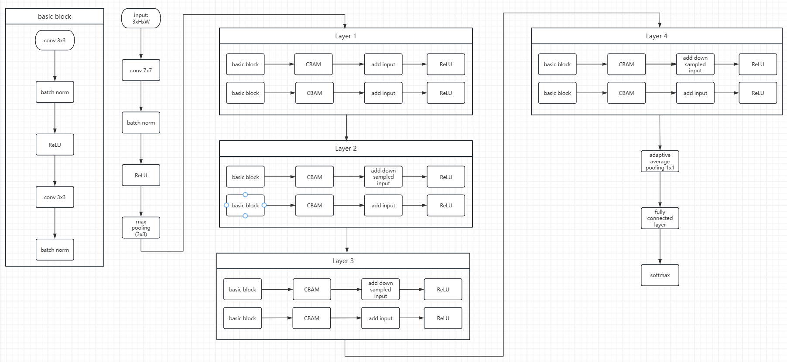

project:
  title: "Leaf Disease Detection (APS360 Project)"
  course: "APS360 – Applied Fundamentals of Deep Learning"
  institution: "University of Toronto"
  description: >
    A deep learning project focused on automated plant disease recognition
    from leaf images. The project explores multiple neural network architectures
    to improve accuracy and robustness, simulating a real-world agricultural
    AI application for early disease detection.

  overview:
    goal: "Classify plant leaf diseases using computer vision and neural networks"
    approach:
      - Built CNN-based image classification models
      - Applied transfer learning on pretrained architectures
      - Performed systematic experimentation and evaluation
      - Simulated real-world agricultural AI use cases

  architecture:
    name: "ResNet18 + CBAM + Soft Voting Ensemble"
    description: >
      The final model is an ensemble architecture combining a ResNet18 backbone
      with Convolutional Block Attention Module (CBAM) for enhanced feature
      representation. Predictions from multiple trained models are aggregated
      using soft voting to improve robustness and generalization.
    components:
      - ResNet18 backbone
      - CBAM attention module
      - Ensemble learning via soft voting
    diagram:
      

  contributions:
    - Designed and trained custom Convolutional Neural Networks (CNN)
    - Implemented ResNet18 with CBAM attention mechanism
    - Built ensemble model using soft voting strategy
    - Experimented with Vision Transformer (ViT) architecture
    - Applied data augmentation techniques to improve generalization
    - Tuned hyperparameters for better validation accuracy
    - Evaluated model performance using accuracy and validation metrics
    - Collaborated within a team using structured experimentation and reporting

  technologies:
    languages:
      - Python
    frameworks:
      - PyTorch
    tools:
      - NumPy
      - Matplotlib
      - Jupyter Notebook
    concepts:
      - Deep Learning
      - Convolutional Neural Networks (CNN)
      - Transfer Learning
      - Attention Mechanisms (CBAM)
      - Ensemble Learning
      - Vision Transformer (ViT)

  skills_demonstrated:
    - Deep learning model design and training
    - Attention-based architecture integration
    - Ensemble modeling and evaluation
    - Machine learning experimentation methodology
    - Team-based technical collaboration
